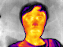
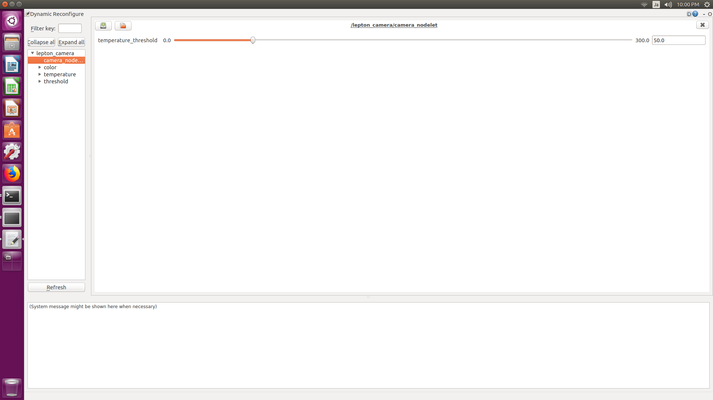

### Requirements
#### GPIO settings
- Nvidia Jetson TX2 with the default carrier board

  Follow https://elinux.org/Jetson/TX2_SPI to update kernel and device tree.
  1. the instruction is compatible with `L4T 28.2`.
  2. in the decompiled `extracted_proc.dts`, please change to `spi-max-frequency = <0xF42400>` (i.e, 16MHz).
  3. check the [pin layout](https://www.jetsonhacks.com/nvidia-jetson-tx2-j21-header-pinout/) of Jetson TX2
- Intel UPboard

  Follow https://wiki.up-community.org/Ubuntu to replace the kernel: `Install Ubuntu kernel 4.15.0 for UP from PPA on Ubuntu 16.04`

#### Udev rules
- Nvidia Jetson TX2 with the default carrier board
  Change the access permision of /dev/spidev-*.* and /dev/i2c-* by following command
  ```
  $ rosrun lepton_thermal_sensor create_udev_rules
  ```

- Intel UPboard

  Follow the instruction of "Enable the HAT functionality from userspace" in the [official wiki](https://wiki.up-community.org/Ubuntu_18.04#Enable_the_HAT_functionality_from_userspace)

### Usage
#### Default command:
- Nvidia Jetson TX2 with the default carrier board
```
$ roslaunch lepton_thermal_sensor nodelet.launch spi_id:=3.0 spi_speed:=16000000 i2c_id:=0
```
**note**: connect SPI to `/dev/spidev3.0` (pin 19, 21, 23, 24), I2C to `/dev/i2c-0` (pin 27, 28). You can also set as `i2c_id:=1` by connecting to `/dev/i2c-1` (pin 3, 5).

- Intel Upboard
```
$ roslaunch lepton_thermal_sensor nodelet.launch spi_id:=2.0 spi_speed:=10000000 i2c_id:=1
```
**note**: connect SPI to `/dev/spidev2.0` (pin 19, 21, 23, 24), I2C to `/dev/i2c-1` (pin 3, 5).


#### Topics
1. Thermal image for visulation: `/lepton_camera/color/image`
    **note**: you can view by `$ rqt_image_view`:
    <div align="center">
    
    </div>
   
2. Temperature (Celsius) image: `/lepton_camera/temperature/image`
    **note**: this image topic is not visualizable. You can subscribe like following scripts:
  ```
  $ rosrun lepton_thermal_sensor capture_temperature_image.py
  ```
3. Threshold Image: `/lepton_camera/threshold/image`:
  
  <div align="center">
    
  </div>
  
  **note**: you can also change the threshold by the dynamic reconfigure as follows:
  <div align="center">
    
  </div>

### Option: V4L2 loopback mode

#### load the loopback kernel module
```
$ sudo modprobe v4l2loopback
```

#### start video streaming

- Nvidia Jetson TX2 with the default carrier board
```
$ roslaunch lepton_thermal_sensor v4l2loopback.launch spi_id:=3.0 spi_speed:=16000000 i2c_id:=0 video_id:=1
```

- Intel Upboard
```
$ roslaunch lepton_thermal_sensor v4l2loopback.launch spi_id:=2.0 spi_speed:=10000000 i2c_id:=1 video_id:=0
```
